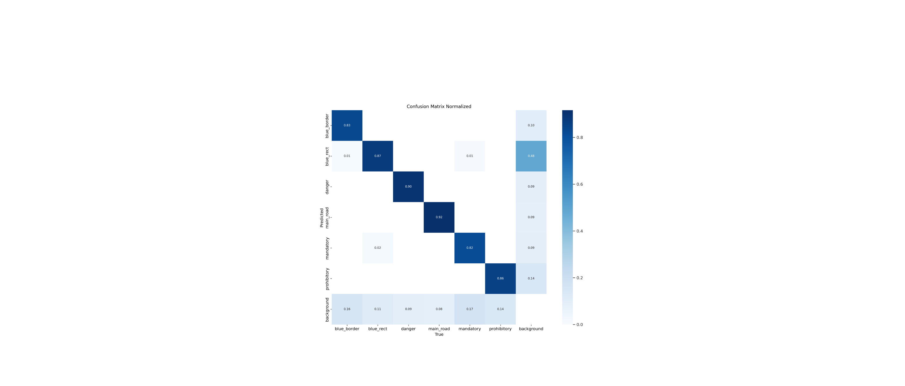
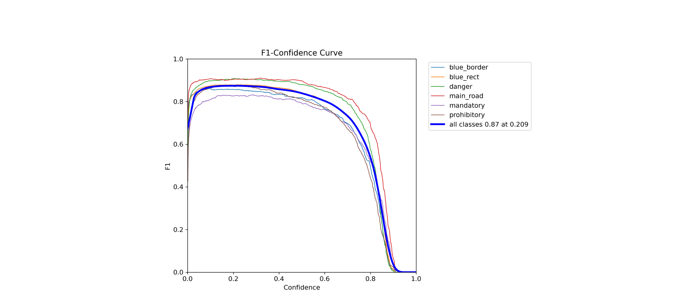
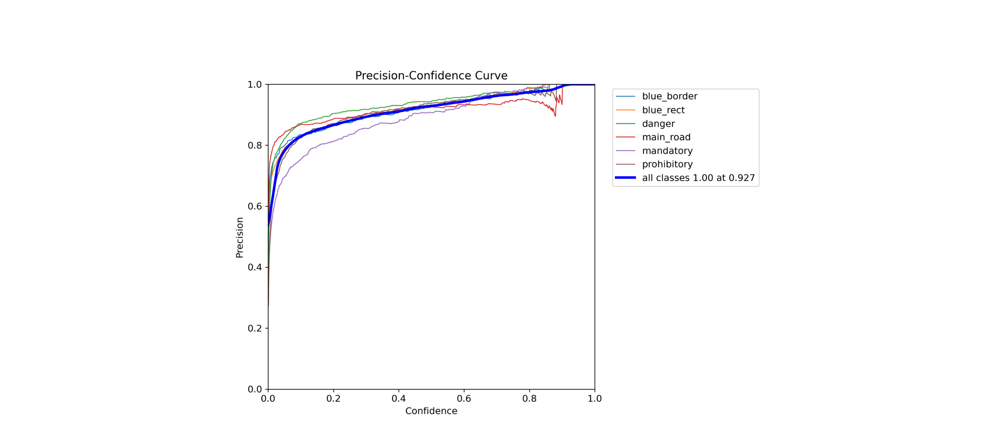
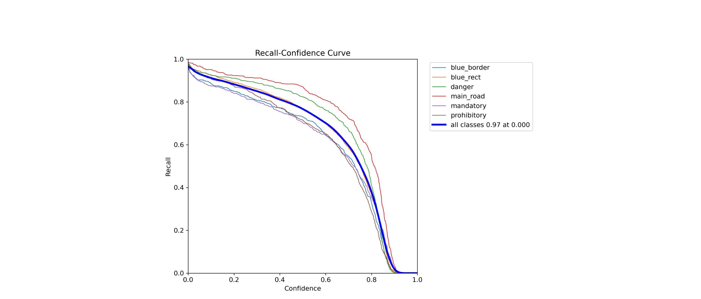
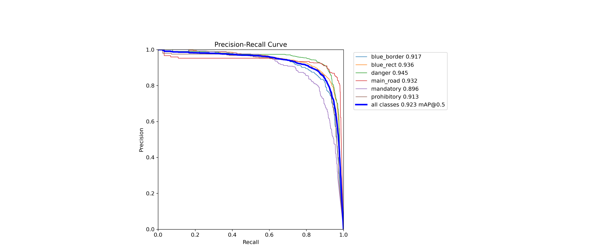
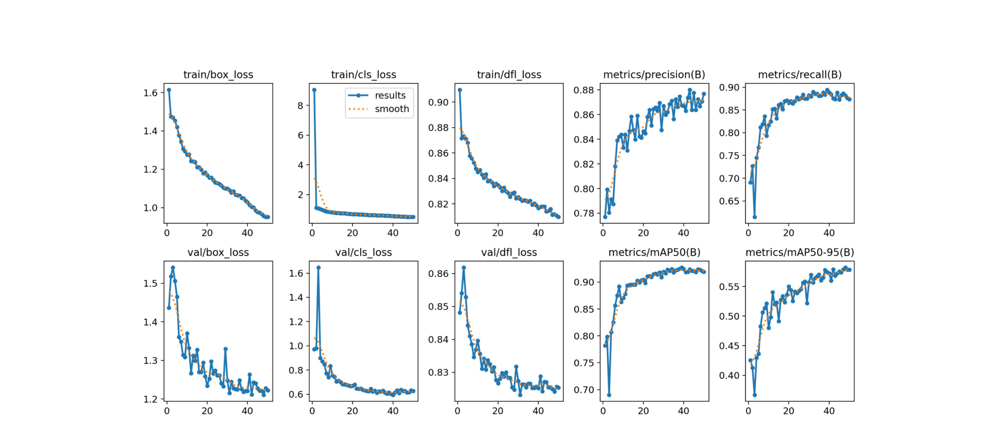

# Results of experiment 2

In this experiment, the YOLOv8s model was used.
Parameters set during training:
+ Number of epochs - 50
+ Batch size - 50
+ Image size - 640
+ Close mosaic - 10

[Link](https://app.clear.ml/projects/199d3c5c623744d692293be36e515961/experiments/256dde2a5edf44c691a7d2452387c3d4/output/execution) to the experiment in ClearML.

The graphs are shown below as training evaluations:

