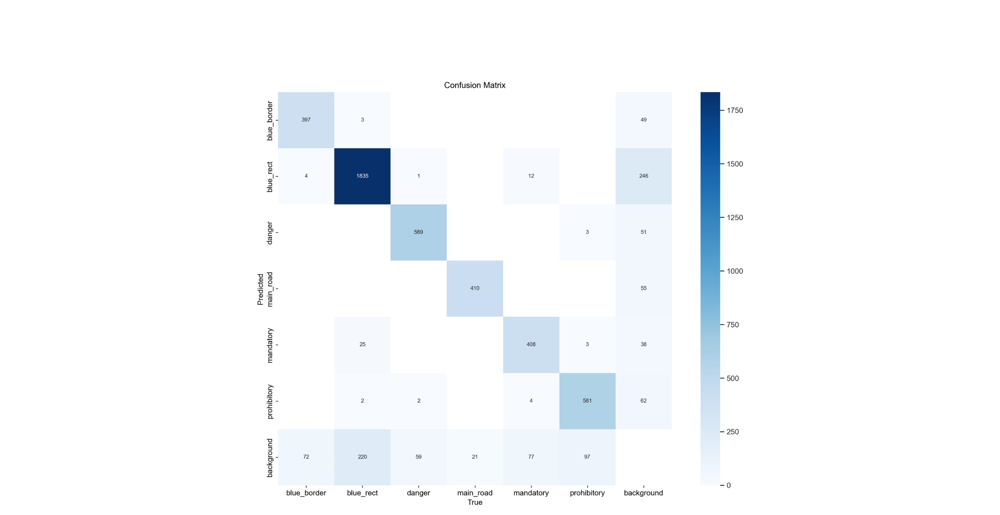
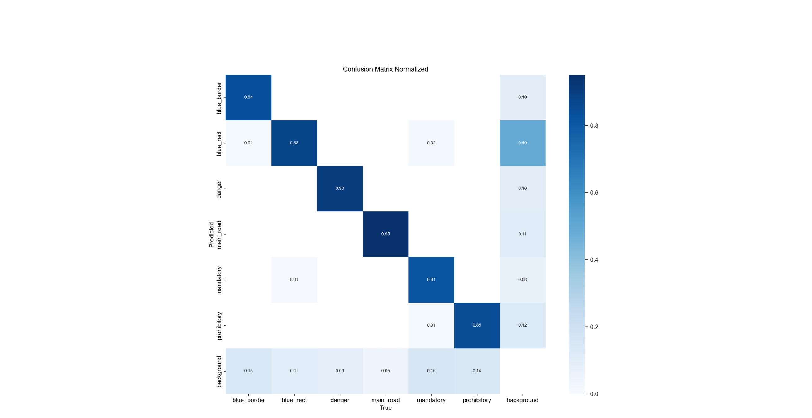
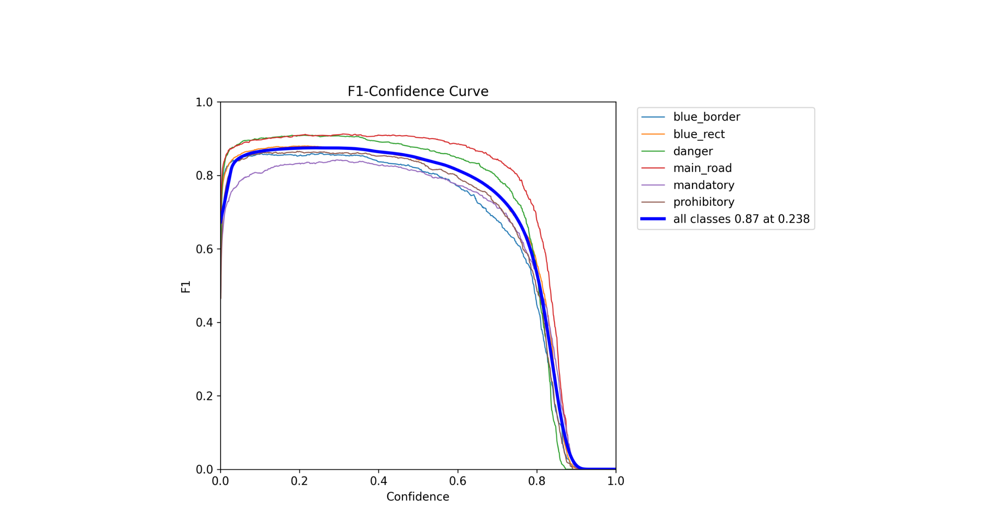
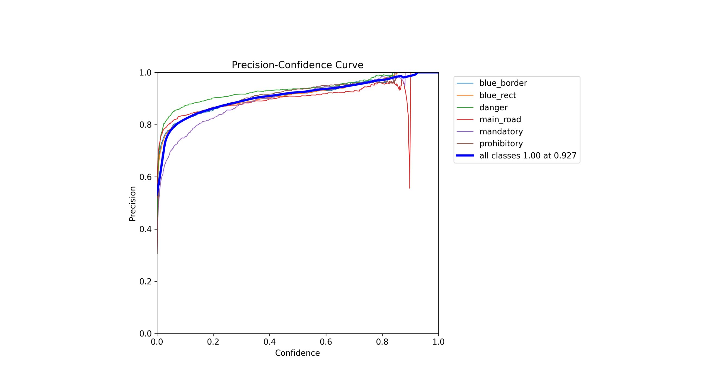
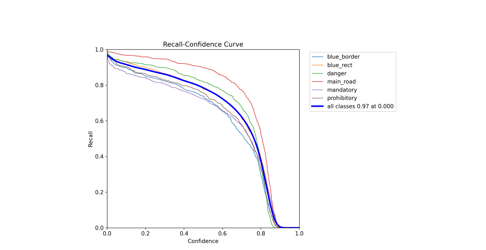
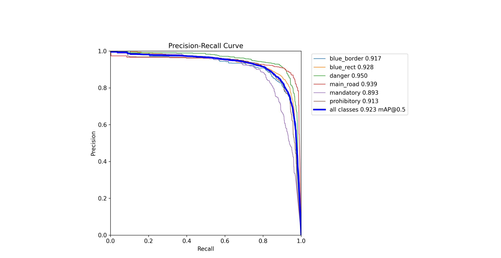
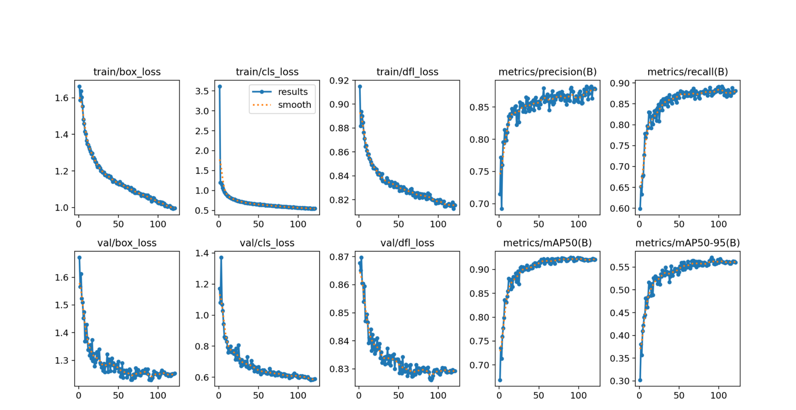

# Results of experiment 5

In this experiment, the YOLOv5s model was used.
Parameters set during training:
+ Number of epochs - 500
+ Batch size - 40
+ Image size - 640
+ Close mosaic - 100

[Link](https://app.clear.ml/projects/199d3c5c623744d692293be36e515961/experiments/41eb5bfdc32e4621acc1c3d782b9665a/output/execution) to the experiment in ClearML.

The graphs are shown below as training evaluations:

